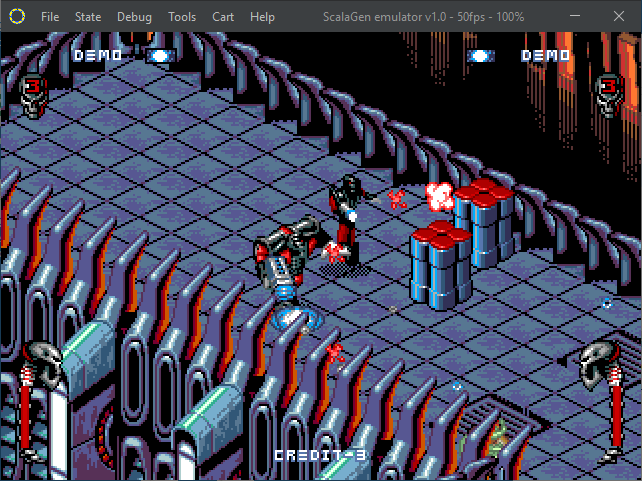
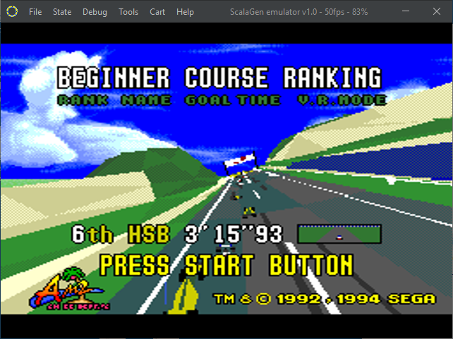

  

# ScalaGen ver 1.0
Sega Mega Drive (Genesis) Scala Emulator

### Emulator features
-----------
- PAL/NTSC regions
- TMSS
- Full debugger
  - Motorola 68000
  - Z80
  - SVP (Sega Virtual Processor)
  - Memory viewer & editor
      - VDP VRAM, CRAM, VSRAM
      - Cartridge's rom
      - 68K ram
      - Z80 ram
      - SVC DRAM, RAM A, RAM B
  - Pattern layers viewer
  - Pattern dump viewer
  - Layer A/B/S on/off
  - Sprite Cache viewer
  - Sprite boundaries on/off
  - DMA trace
  - Disassembler
  - Breakpoints
  - Frame by frame mode
  - Live disassembly on file
- Snapshots: load/save
- Events saving & playback
- Game Genie cheats DB
- Controllers: keyboard, USB joystick, mouse, lightgun
- VDP debug register
- PSG emulation: thanks to Chris White (http://www.smspower.org/dev/docs/wiki/Sound/PSG)
- FM emulation: Ym2612Nuke, thanks to Federico Berti for his Java porting (https://github.com/fedex81/helios)
- SVP emulation
  - Full emulation of internal rom (https://github.com/jdesiloniz/svpdev/wiki/Internal-ROM). The rom source has been compiled with my own compiler.
  - See also https://github.com/jdesiloniz/svpdev/tree/master/samples
- Performance monitor

### Download
-----------
Go to https://github.com/abbruzze/sega-md/releases/latest and download and unzip on your computer the latest version.
Be sure to have a jre (17 or above, best performance on 22) in the path and launch in the bin directory:
- On Windows: **scalagen.bat**
- On Linux: **scalagen.sh**

### Default keybindings
-----------

**Player 1**

 Button        | Mapped to
 --------------|-------------
 Start         | Enter
 A             | A
 B             | S
 C             | D
 X             | Q
 Y             | W
 Z             | E
 Mode          | R
 Up            | Cursor Up
 Down          | Cursor Down
 Left          | Cursor Left
 Right         | Cursor Right

**Player 2**

  Button        | Mapped to
 --------------|-------------
 Start         | Backspace
 A             | J
 B             | K
 C             | L
 X             | U
 Y             | I
 Z             | O
 Mode          | P
 Up            | Y
 Down          | B
 Left          | H
 Right         | L

# Games gallery
||||
|-|-|-|
||||
||||
||||
||||
||||
||||
||||
||||
||||
||||
||||
||||
||||
||||

# Demos gallery
||||
|-|-|-|
||||
||||

# Debugger gallery
|||
|-|-|
|||
|||
